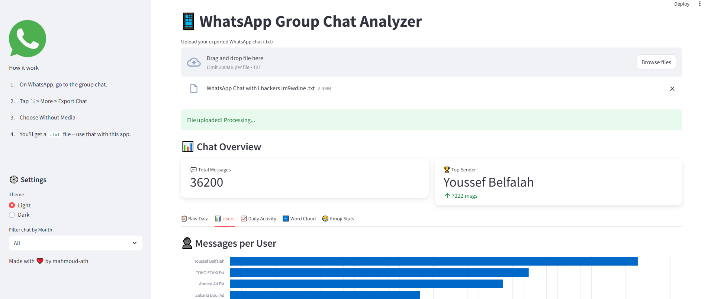

````markdown
# 📊 WhatsApp Chat Analyzer

A fun and interactive Streamlit app that visualizes and analyzes exported WhatsApp group chats. Quickly get insights like top message senders, word usage, emoji stats, message activity trends, and more.

---

## 🚀 Features

- 📂 Upload your exported WhatsApp chat `.txt` file  
- 🗓️ Filter chats by month  
- 👤 See who sends the most messages  
- 🔤 Most used words (excluding common ones)  
- 😂 Top 10 used emojis  
- 📅 Messages over time  
- ☁️ Word Cloud visualization  
- 📊 Beautiful and interactive dashboards (Altair, Streamlit charts)  
- 🌗 Light/Dark mode toggle  
- 🧭 Organized layout with sidebar and tabs  

---

## 📁 How to Export WhatsApp Chat

1. Open the WhatsApp group you want to analyze.  
2. Tap the three dots → More → Export chat.  
3. Choose **Without media**.  
4. Send the `.txt` file to yourself (email, Google Drive, etc.).  
5. Download it to your computer.  

---

## 💻 Getting Started

### 1. Clone the repository

```bash
git clone https://github.com/mahmoud-ath/whatsapp-chat-analyzer.git
cd whatsapp-chat-analyzer
````

### 2. Install dependencies

Make sure you have Python 3.9+ installed.

```bash
pip install -r requirements.txt
```

### 3. Run the Streamlit app

```bash
streamlit run app.py
```

Open your browser to:
`http://localhost:8501`

Or, if you use a tunnel (e.g., DevTunnel), access via the provided public URL.

---

## 📸 Screenshots

| Dashboard Overview                  
| ------------------------------------- |  
|  | 

*(Add your screenshots in the `screenshots/` folder)*

---

## 🛠 Tech Stack

* Streamlit
* Pandas
* Altair
* Matplotlib
* WordCloud
* Emoji

---

## 📃 License

MIT License. Feel free to use and modify.

---

## 👤 Author

Made with ❤️ by mahmoud-ath

```
